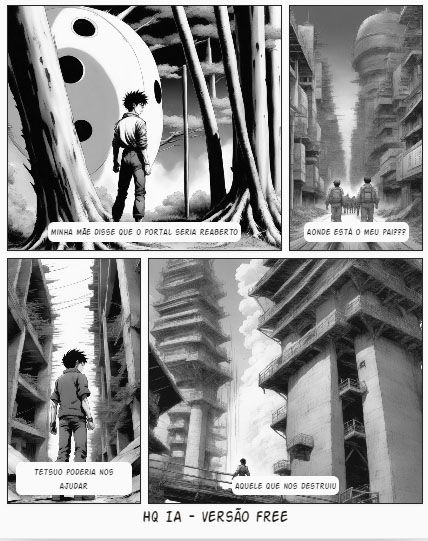

### Template

```markdown
# Título do Projeto Extremamente Aesthetic ;)

## 📒 Descrição
Continuação do HQ AKIRA

## 🤖 Tecnologias Utilizadas

https://app.leonardo.ai/ai-generations
    #para gerar a capa

https://editoraitacaiunas.com.br/quadrinhos-ia/
    #para gerar o conteudo

## 🧐 Processo de Criação
Vontade de um dia ver a continuação da estória do AKIRA

## 🚀 Resultados
Apresente os resultados do seu projeto



## 💭 Reflexão (Opcional)
achei interessante a idéia
