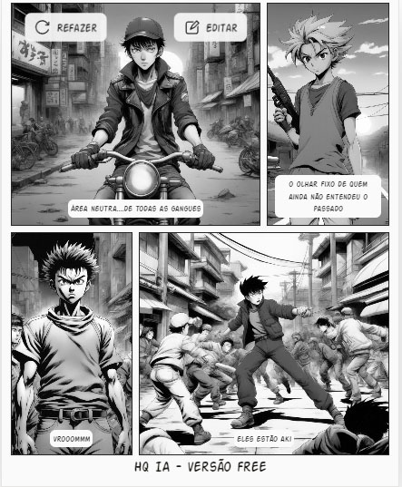

### Template

```markdown
# Título do Projeto Extremamente Aesthetic ;)

## 📒 Descrição
Continuação do HQ AKIRA

## 🤖 Tecnologias Utilizadas

https://app.leonardo.ai/ai-generations
    #para gerar a capa

https://editoraitacaiunas.com.br/quadrinhos-ia/
    #para gerar o conteudo

## 🧐 Processo de Criação
Vontade de um dia ver a continuação da estória do AKIRA

## 🚀 Resultados
Apresente os resultados do seu projeto
exemplos/capacópia.jpg





## 💭 Reflexão (Opcional)
achei interessante a idéia

### Exemplos e Insigths

- [E-BOOK](/exemplos/E-BOOK.md)
- [Podcast](/exemplos/PODCAST.md)
- [Vídeo (Avatar Virtual)](/exemplos/VIDEO.md)

## Links Interessantes

[Base10: If You’re Not First, You’re Last: How AI Becomes Mission Critical](https://base10.vc/post/generative-ai-mission-critical/)


